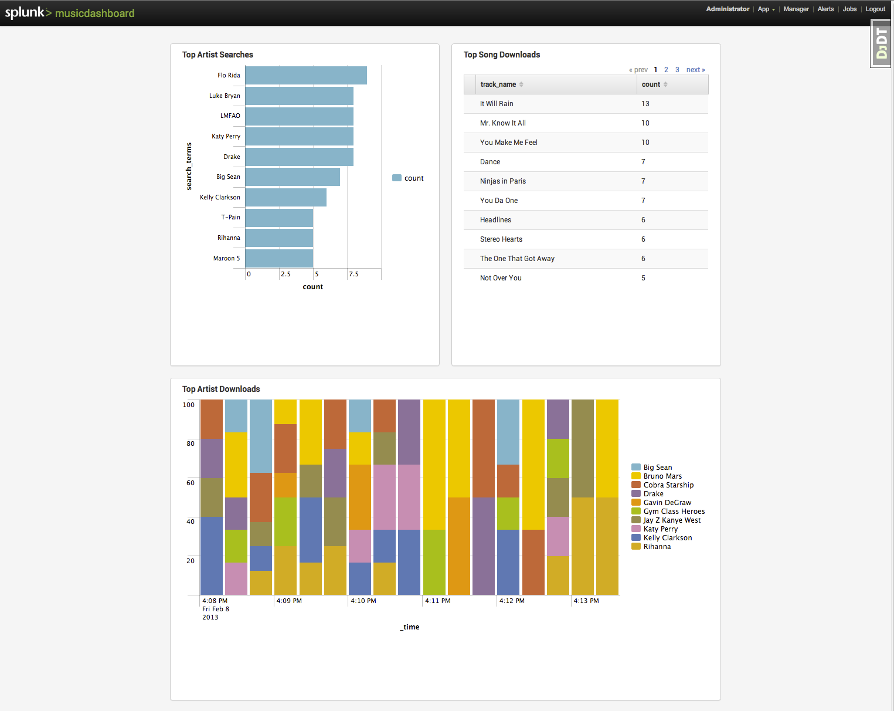
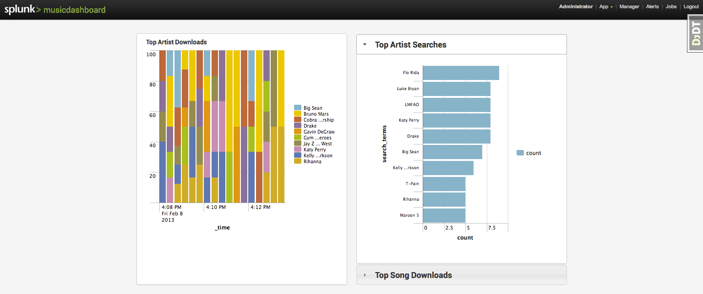
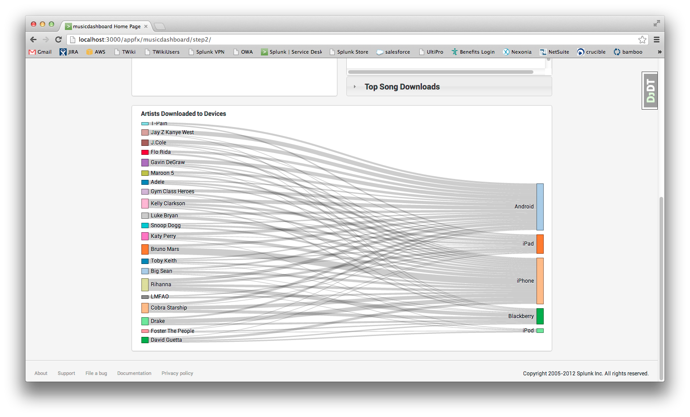
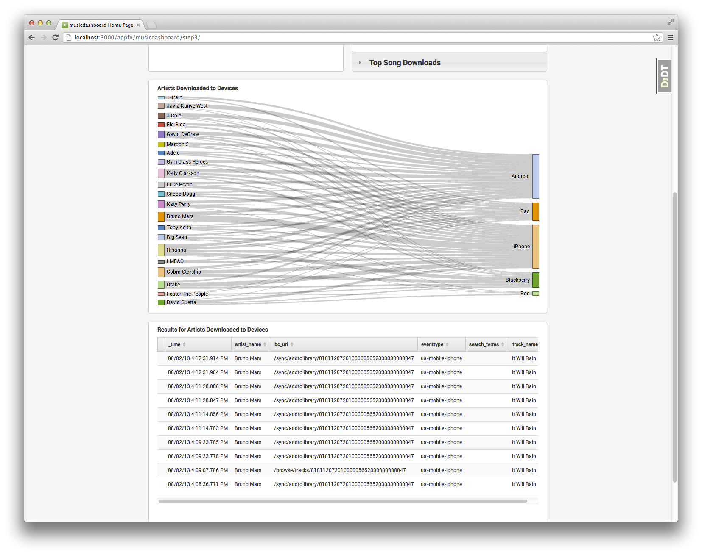
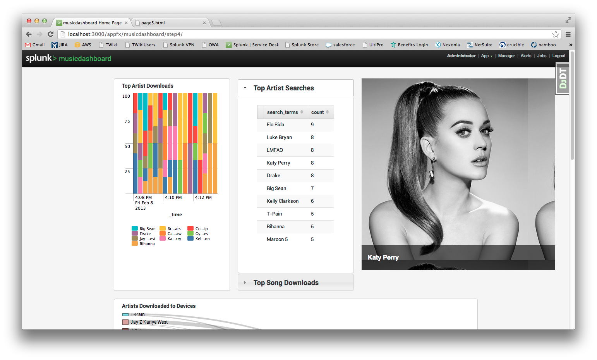

# Diving into the Splunk App Framework

As mentioned in previous posts, the recently released Splunk App Framework allows developers to draw from the power of modern web programming to create new and exciting applications built on Splunk. I'm really excited about all the new abilities the framework provides, and I think it will help usher in some really awesome Splunk Apps.

When I first got my hands on the framework, I wanted to show off how quickly and easily a web developer, such as myself, could use standard web technologies to make a simple yet compelling dashboard for Splunk. 

Let's get started!

## Setup
If you haven't already, you'll first need to grab the Splunk App Framework from GitHub. To get yourself set up, get over to [the Splunk App Framework GitHub repo](https://github.com/splunk/splunk-appframework) and follow the instructions on that page.

Once you've gotten the framework set up, create a new empty app and start the framework by entering:

    ./appfx createapp musicdashboard 

You'll need to provide your Splunk login credentials. Then, enter:
    
    ./appfx run

Navigate to **$APPFRAMEWORK_HOME/server/apps/musicdashboard** and update the first string in your `__init__.py` to something friendly, like "Music dashboard!" and save it.

Then, navigate to <i>http://localhost:3000/appfx/</i>, log in again on the righthand side, and observe that your new musicdashboard app appears on the Splunk App Framework home page with the other apps. 

**NOTE**: For all the examples in this post, we use Google Chrome because it's the only browser that supports some of the features we will use. So when following along, use Chrome for the best experience.

Now we'll need some demo data. Grab the CSV file located [here](http://github.com/splunk/splunk-demo-musicdashboard/master/musicdashboard/splunkd/lookups/musicdata.csv) and drop it in the **$APPFRAMEWORK_HOME/server/apps/musicdashboard/splunkd/lookups** folder (you'll need to create that subfolder). 

At any time, you can take a look at the [splunk-demo-musicdashboard repository](http://github.com/splunk/splunk-demo-musicdashboard), which includes the source code for each step of this example.

## Step 0: Basic Dashboard

Before we dive into the more advanced features of the Splunk App Framework, let's build a basic dashboard, very reminiscent of a dashboard you might find in existing Splunk Apps found on Splunkbase.

First, navigate to the **$APPFRAMEWORK_HOME/server/apps/musicdashboard/templates** folder, and open home.html in an editor. This HTML file was placed there as part of the `createapp` setup. Let's make a few dashboard panels using our demo data from the setup portion. We'll make the following dashboards:

* A chart showing the artists most searched for
* A result table showing the songs most downloaded
* A chart showing the artists most downloaded

Something to note is that the Splunk App Framework includes [Bootstrap styles](http://twitter.github.com/bootstrap/), so some of the layout patterns you'll see below are in that vein.

Let's add some CSS to the CSS block of our HTML template file by replacing the `` with this:

	
	
	    <link rel="stylesheet" type="text/css" href="{{STATIC_URL}}{{app_name}}/custom.css" />

	    
	

Now we'll add some charts that we'll use to display data. The layout structure here uses the custom CSS we've just defined plus Bootstrap styles:

	

	

	    

	        

	            

	                

	                    <h4>Top Artist Searches</h4>
	                

	                

	                    
	                

	            

	        

	        

	            

	                

	                    <h4>Top Song Downloads</h4>
	                

	                

	                    

	                        
	                    

	                    
	                

	            

	        

	    

	    

	        

	            

	                

	                    <h4>Top Artist Downloads</h4>
	                

	                

	                    
	                

	            

	        

	    

	

	

As you can see, it's very simple and standard to add charting UI, using Django templates, to your page with a nice dashboard layout. You'll notice that all of these charts take as an option a `contextid`, which points to a search context. We'll define those right now. Immediately after the `` line, insert the following code:

	
	    

	    

	    

	

Finally, let's use the Splunk App Framework JavaScript API to add some advanced options to one of our charts. Replace your `` with this:

	    
	    
	

All right, save this page and let's open up <i>http://localhost:3000/appfx/musicdashboard</i> and take a look!

## Step 1: jQuery UI Accordions

Awesome, so by now we've gotten our basic dashboard set up, so we know we can use the framework to make Splunk dashboards. But I wouldn't be writing this post if I didn't want to show you some of the really cool features we've enabled.

So, let's say that you've decided our dashboard looks too cluttered. For instance, it would be great if we could collapse the "Top Artist Searches" and "Top Song Downloads" into one container, and place the "Top Artists Downloads" chart to the left, achieving just one row of charts. As a web developer, you are aware that there are many open-source UI widgets available from the web. A popular widget library is [jQuery UI](http://jqueryui.com/). We'll choose the [accordion widget](http://api.jqueryui.com/accordion) that is described on that site to help us out with our cluttered layout.

In navigating to the documentation for the accordion widget, we see [this section](http://api.jqueryui.com/accordion/#entry-examples), describing how to integrate the widget into web pages. Let's use this example to modify our code a bit.

Using the instructions on that page, let's update our layout code, starting with the CSS codeblock on the musicdashboard's home.html page. Add this jQuery UI reference to the `` section:

	<link rel="stylesheet" href="http://code.jquery.com/ui/1.10.0/themes/base/jquery-ui.css">

Also, the layout of the panels inside the accordion needs to be changed slightly, so let's add this within our `<style>` tag:

	.panel.accordion {
    	margin-bottom:0px;
        height: 430px;
    }

Now, let's rework our `` section so that we have just one `
` and the column chart appears before the other charts. Here's the code with our simple layout updates:

	

	

		<!-- First row -->
	    

	       <!-- Moved up -->
	       

	            

	                

	                    <h4>Top Artist Downloads</h4>
	                

	                

	                    
	                

	            

	        

	        

	            

	                <h3>Top Artist Searches</h3>
	                

	                    

	                        
	                    

	                

	                
	                <h3>Top Song Downloads</h3>
	                

	                    

	                        

	                            
	                        

	                        
	                    

	                

	            

	        

	        
	    

	    <!-- End first row -->
	

	

Just like the jQuery UI documentation instructed, we've wrapped our charts in a single `
` tag with `id="accordion"`. To get the full functionality, we simply need to add a reference to the jQuery UI Accordion in our `` section:

	

**NOTE:** There is no need to include jQuery itself because it is already included with the Splunk App Framework.

And just before the line of code `AppFx.on('start', ...);` let's add this JavaScript:

	$('#accordion').accordion();

Just as the documentation describes. Reload the page and see how easy it was to integrate that accordion!

## Step 2: D3

Now that our UI is no longer as cluttered, we've freed up some screen real estate for perhaps another dashboard panel. This time, we don't want to use any of the built-in Splunk charts to display our data, but instead we decide that a chart from the [D3 gallery](https://github.com/mbostock/d3/wiki/Gallery) might help us best to gain insight into our data. (As a side note, if you haven't before, peruse the D3 gallery. It's fun!)

For this example, we'll choose the [Sankey diagram](http://bost.ocks.org/mike/sankey/) to help us visualize which artists' songs are downloaded to which mobile devices.

After reading the documentation for the Sankey diagram we see that it is modular, but the code is a little nasty. I've created a helper JavaScript file to abstract away some of the complexity. Grab a copy of the sankey-helper.js file [here](http://github.com/splunk/splunk-demo-musicdashboard/master/musicdashboard/static/musicdashboard/sankey-helper.js) and drop it in **$APPFRAMEWORK_HOME/server/apps/musicdashboard/static/musicdashboard/**. 

Let's also drop some styles in our `<style>` tag back in the home.html page to make the chart nice once it renders:

	#chart {
      height: 500px;
    }

    .node rect {
      cursor: move;
      fill-opacity: .9;
      shape-rendering: crispEdges;
    }

    .node text {
      pointer-events: none;
      text-shadow: 0 1px 0 #fff;
    }

    .link {
      fill: none;
      stroke: #000;
      stroke-opacity: .2;
    }

    .link:hover {
      stroke-opacity: .5;
    }

OK, now for the good stuff. Let's include this D3 component on the page. To start, we'll provision some layout for the chart. Let's make a new row in our container div. Add this code just before the container div's closing tag:

	<!-- Second row -->
	

        

           

                

                    <h4>Artists Downloaded to Devices</h4>
                

                

                    

                

            

        

    

    <!-- End second row -->

Specifically, notice the `

` tag. Now that we have our layout in place, let add the search that will drive the data for the chart. To our `` section, add this search context:

	

Let's wire up the JavaScript. Add some more reference `
    
    

And now for the code. First, we'll bind to a data context on the search, then run it. Once the search gets data back, we will format it properly for the Sankey diagram. Finally, we will render the diagram. Notice that in the code below, we did not have to make a custom Splunk App Framework component for this diagram to work. Everything is wired up using typical web programming patterns. Here's what the inline script tag looks like now:

	

And that's it! No black magic!

## Step 3: Interactivity

After having our Sankey diagram in place, it's great to see the relationships in our data, but what if we're also interested in which Splunk events are specifically driving the output for this chart? With just a few more lines of code we can wire up the Sankey diagram to an existing Splunk widget. When you click on a link between an artist and a mobile device, now you'll be able to see which events were responsible for the magnitude of that link.

First, we'll add a little bit of CSS to ensure the link that we click on will stay highlighted. Also, we'll add a little helper CSS to make the built-in Splunk events table scrollable. In our `<style>` tag, add this:

	.link.my-selected {
        stroke: yellow;
    }

    .scrollable {
    	overflow-y: auto;
    }
        

In terms of layout, we'll just add another row with the Splunk `eventtable` widget after the one containing the Sankey diagram:

	<!-- Third row -->
	

        

            

                

                    <h4>Results for Artists Downloaded to Devices</h4>
                

                

                    
                

            

        

    

    <!-- End third row -->

We'll also need a search context to help us grab the data to drive the output for this `eventtable`. Add this to the `` section:

	

(Notice how we can easily parameterize the `search` attribute using `$...$` tokens. Check out the JavaScript later for the token replacements.)

Now all we need to do is wire these two UI widgets together using some straighforward JavaScript. Look for these two lines of code in the inline `

We'll add a container for Flux to bind to. To do this, let's update our first row of panels to take up less horizontal space and add the new container. Edit the `
...
` section that is surrounded by the comments `<!-- First row -->` and `<!-- End first row -->`. Here's the final result:

	<!-- First row --> 
	

       

            

                

                    <h4>Top Artist Downloads</h4>
                

                

                    
                

            

        

        

            

                <h3>Top Artist Searches</h3>
                

                    

                        
                    

                

                
                <h3>Top Song Downloads</h3>
                

                    

                        

                            
                        

                        
                    

                

            

        

        

            

                

            

        

        
    

    <!-- End first row -->

Specifically, notice that we've added a `
` with `id="slider"` for the Flux container. Additionally, we've changed `chart-top-artist-searches` to a `resulttable`, which will look better with the shorter width.  Also, let's add this CSS style to our `` section:

	.panel.slider-panel {
        overflow:visible;
        background-color: initial;
        border: none;
        box-shadow: none;
        max-height: 400px;
        max-width: 300px;            

    }

Then, find the `// TODO UI CODE` line and replace it with this:

	var $slideShow = $('#slider');
	$slideShow.empty();
	_.each(artists, function(artist) {
	    var $el = $('');
	    $slideShow.append($el);
	});

	$slideShow.show();
	new flux.slider('#slider', {
	    pagination: false,
	    captions: true
	});

Now, save changes and navigate to your page, wait a moment, and lo! images!

## No limits
Hopefully I've given you a good introduction to the new features allowed by the Splunk App Framework. As I've said, I'm really excited to see what developers can build using the new capabilities we've unveiled. Happy coding!

